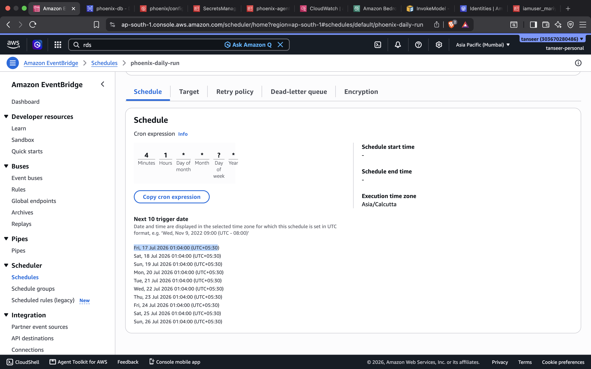
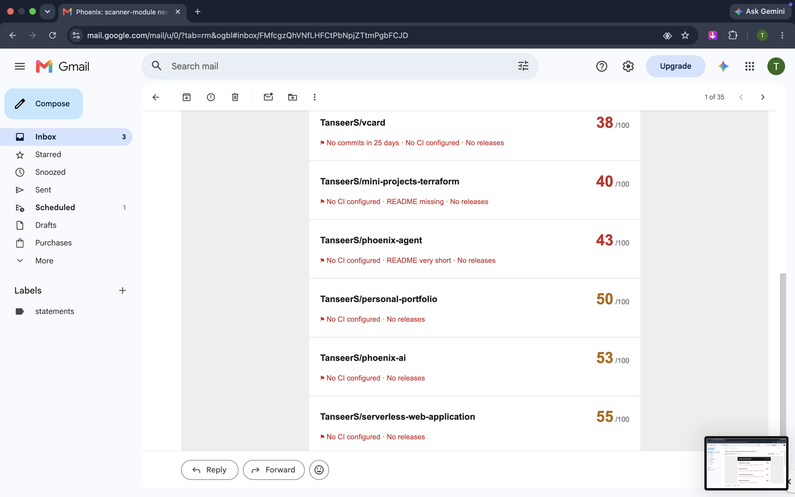
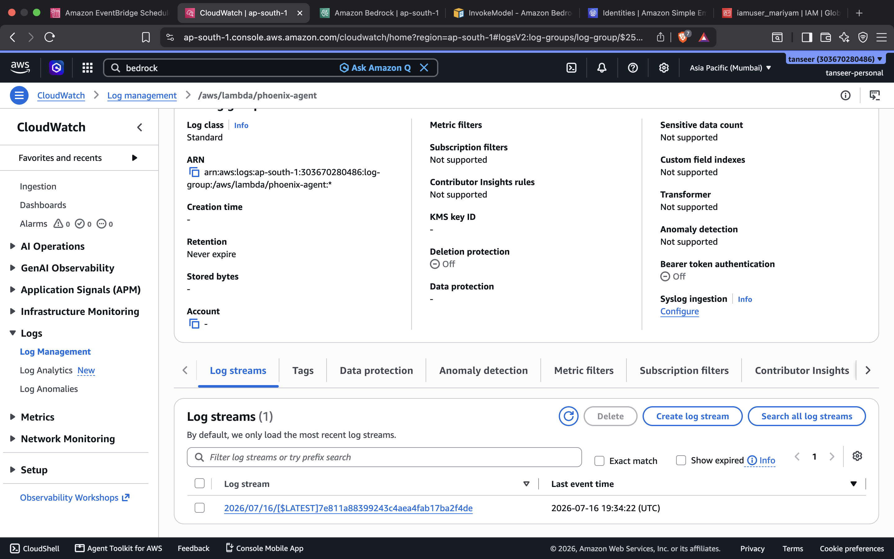
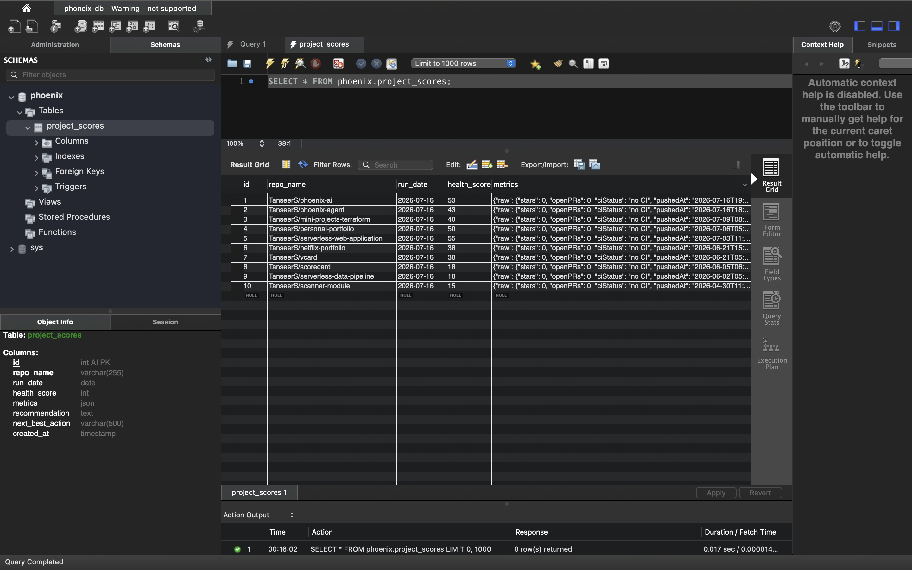
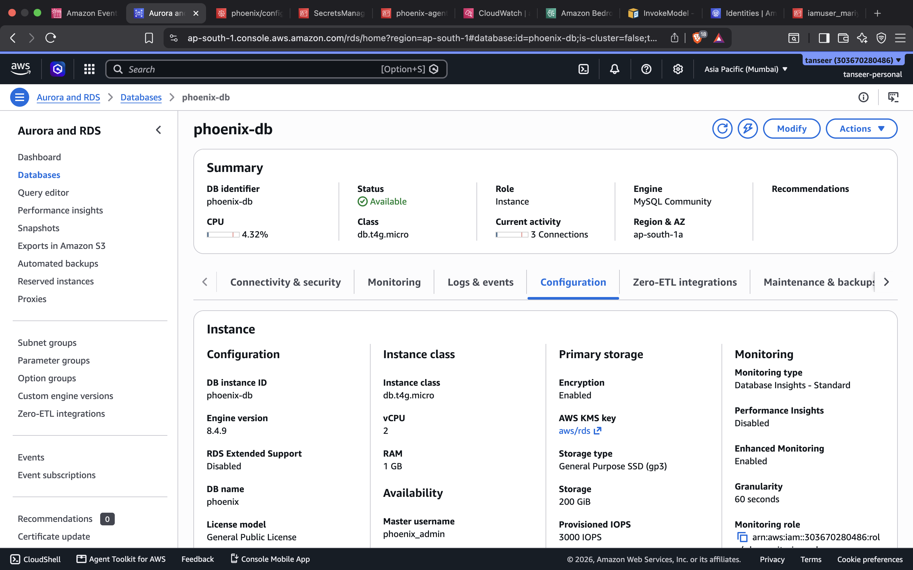

# Phoenix

Phoenix is a personal AI agent that keeps watch over my GitHub repositories so I don't have to. Once a day it wakes up on its own, looks at what changed across my projects, scores the health of each one, asks an LLM what deserves attention, and sends me the result as an email. There is no server to keep running and nothing to remember to do: the whole thing is a single Lambda function on a schedule.

## What it does on each run

1. **Scan** — fetches my most recently pushed repositories from the GitHub API (skipping forks and archived repos) and collects signals for each: commits in the last 30 days, open issues and pull requests, latest CI run result, latest release, and the README.
2. **Score** — a deterministic health engine turns those signals into a 0-100 score per repository, with points for commit recency and volume, CI status, README quality, issue hygiene, and release recency. Problems become human-readable flags like "No commits in 45 days" or "CI failing".
3. **Bedrock analysis** — all scored repositories go to Amazon Bedrock (Nova Lite) in a single call. The model returns a short diagnosis per repository, one concrete next action for each, and a portfolio-level summary naming the repo that most deserves attention today.
4. **MySQL** — scores, metrics, and recommendations are written to a MySQL database on RDS, one row per repository per day, so score history builds up over time and each report can show the change since the previous run.
5. **Email** — an HTML report is sent to me through SES, worst-scoring repository first.

If one step degrades — a repo fails to scan, the model returns something unparseable, the email bounces — the run carries on with what it has and records a partial status rather than failing outright.

## Architecture


```
EventBridge Scheduler (daily, 1:00 PM Asia/Kolkata)
        |
        v
     Lambda (Node.js 22)
        |
        v
    GitHub API  -->  Health Engine
                        |
                        v
              MySQL (RDS) + Bedrock (Nova Lite)
                        |
                        v
                   SES email report
```

## Tech stack

- **AWS Lambda** — Node.js 22, arm64, plain ES modules, no framework
- **EventBridge Scheduler** — cron `cron(0 13 * * ? *)` with the `Asia/Kolkata` timezone
- **Amazon RDS** — MySQL 8.0 for score history and run logs
- **Amazon Bedrock** — Nova Lite via the Converse API
- **Amazon SES** — delivers the daily report

## How it's triggered

Phoenix runs unattended. EventBridge Scheduler invokes the Lambda function every day at 1:00 PM IST; no manual step is involved. The scheduler passes a small JSON payload identifying itself as the source, and the function does the rest: scan, score, analyze, store, email.

The schedule in EventBridge Scheduler, with the Asia/Kolkata execution timezone and the next trigger dates:



## Results

The report email delivered by SES, received at 01:04 IST — minutes after the scheduled trigger fired (receive time highlighted). The subject names the worst repository and the average score, and the cards are sorted worst first with their flags:


The rest of the same report, scrolled down — scores climb toward the healthier end of the portfolio:



A scheduled run in CloudWatch: the function starts, scans 13 repositories, analyzes 10, and logs a score line per repo:


The Lambda's log group with the run's log stream:



Daily scores and metrics stored in the `project_scores` table on RDS:



## Deployed resources

The Lambda function with the project source deployed:


The RDS MySQL instance:



Verified SES identities used for sending the report:


## What the email report contains

- A subject line that says what matters: either "Phoenix: all projects healthy" or "Phoenix: <repo> needs attention", with the average score
- A portfolio summary naming the one repository most worth attention today
- One card per repository, sorted worst first, showing:
  - the health score (colored green, amber, or red) and its change since the previous run, e.g. `34/100 (-5)`
  - flags such as "No CI configured" or "12 open issues piling up"
  - a two-to-three sentence diagnosis of the project's state
  - one "next best action" completable in under an hour

## Infrastructure

The `infra/` directory contains Terraform that documents the deployed architecture: the Lambda function and its IAM role, the EventBridge schedule, the RDS instance, and the wiring between them. The real deployment was done through the AWS console; the Terraform mirrors it so the setup is reproducible. See `infra/README.md` for prerequisites and caveats before applying it.
