# Phoenix

An autonomous agent that audits my GitHub portfolio every day and emails me what to fix.

Phoenix wakes up on a schedule, scans my repositories, scores each one's health from real signals, asks Amazon Bedrock for a diagnosis and one concrete next action per project, stores the history in MySQL, and delivers the result as an email. No server, no manual step: one Lambda function on an EventBridge schedule.

## Demo

Full walkthrough of a live run — from the scheduled trigger to the report landing in the inbox. Click to watch:

[](https://youtu.be/E1H0wdBvtQM?si=GXZ983yfXyHisxax)

Direct link: [youtu.be/E1H0wdBvtQM](https://youtu.be/E1H0wdBvtQM?si=GXZ983yfXyHisxax)

## Results

The daily report as it lands in my inbox. The subject names the worst repository and the portfolio average; the body opens with an AI-written portfolio summary naming the repo that most deserves attention today:

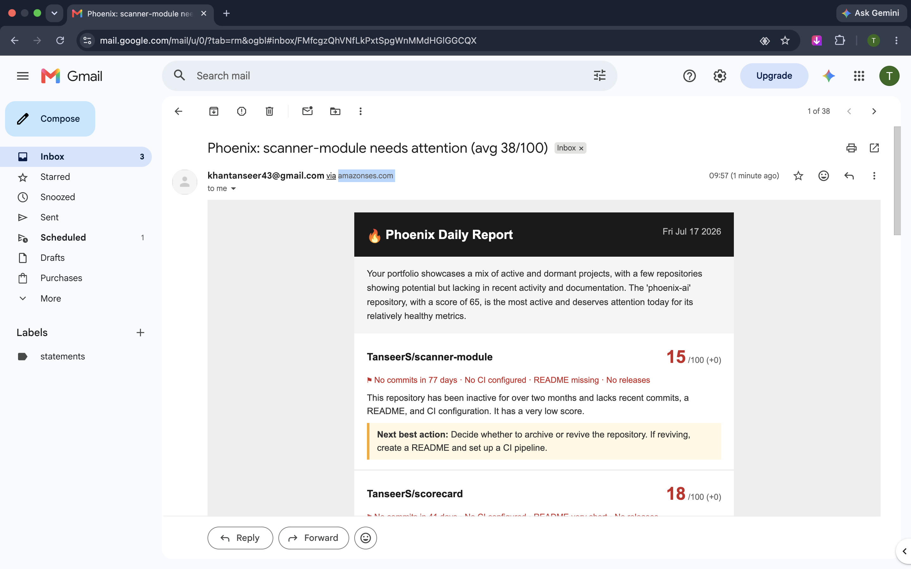

Each repository gets a card: health score, change since the previous run, flags from the health engine, a short AI diagnosis, and one next action sized to fit under an hour:

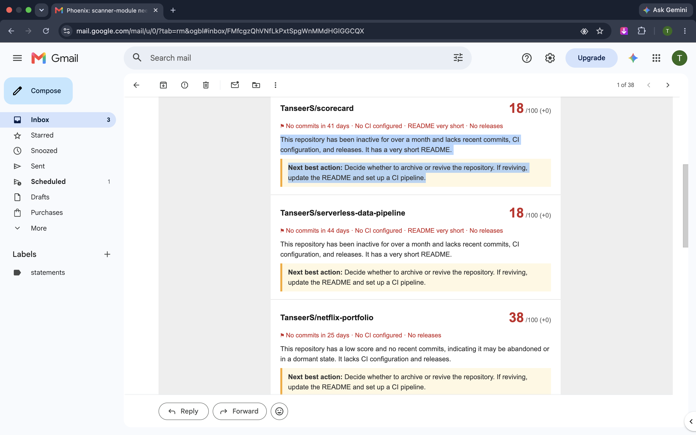

Cards are sorted worst first, so the email ends on the healthiest projects — here with a score delta of +5 since the previous run:

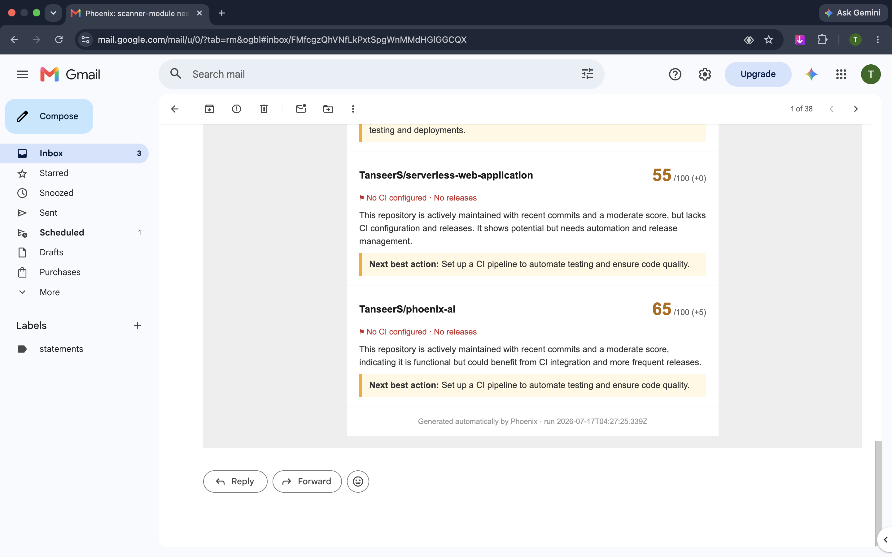

Score history accumulating in MySQL, one row per repository per day. Day one ran before AI analysis was wired in (NULL recommendations); day two has diagnosis and next action for every repo — the delta column in the email comes from comparing these runs:

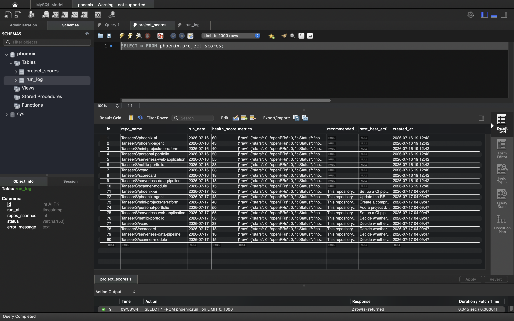

Every run is also logged with its status and repo count:

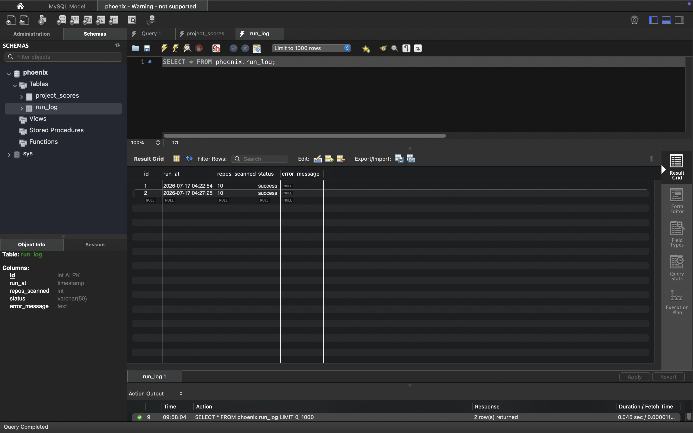

The portfolio Phoenix watches — the repositories on my GitHub profile, spanning JavaScript, TypeScript, HCL, and C#, public and private:

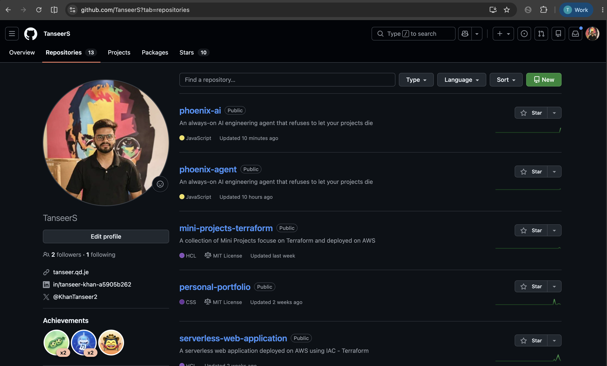

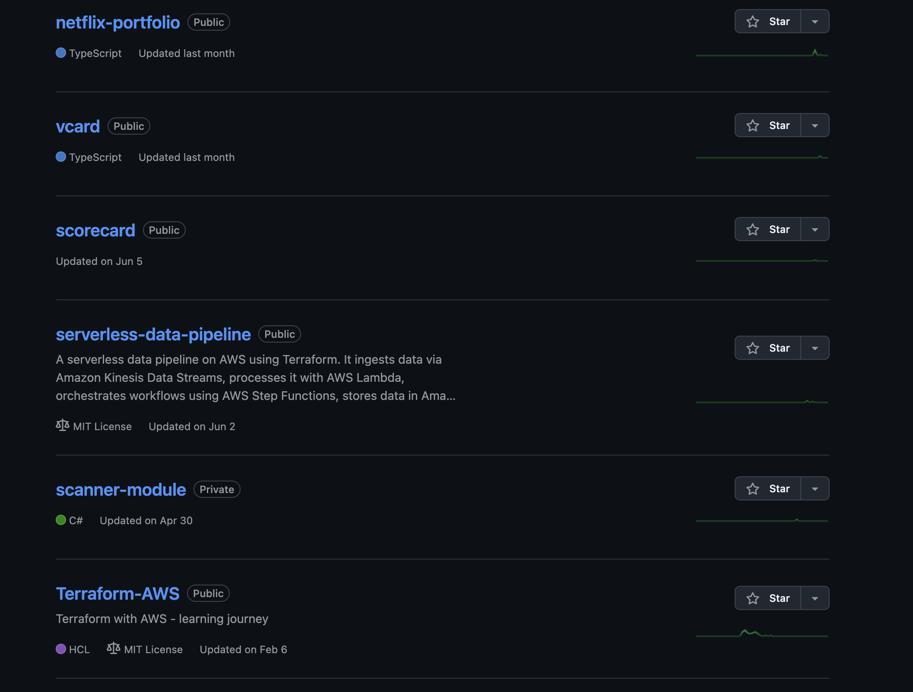

## How it works

Each run is a five-step pipeline:

1. **Scan** — fetch the most recently pushed repositories from the GitHub API (forks and archived repos are skipped) and collect signals per repo: commits in the last 30 days, open issues and PRs, latest CI run result, latest release, README length.
2. **Score** — a deterministic health engine converts the signals into a 0-100 score across six categories: commit recency, commit volume, CI status, README quality, issue hygiene, and release recency. Problems become flags like "No commits in 77 days" or "CI failing".
3. **Analyze** — all scored repos go to Amazon Bedrock (Nova Lite) in a single Converse API call, which returns a diagnosis per repo, a next best action per repo, and a portfolio-level summary.
4. **Store** — scores, metrics, and recommendations are upserted into MySQL on RDS, keyed by repo and date, building the history used for day-over-day score deltas.
5. **Report** — an HTML email (with a plain-text fallback) is rendered and sent through SES.

Every step degrades gracefully: a repo that fails to scan is reported and skipped, a malformed model response falls back to a no-AI report, a database or email failure is logged and recorded as a `partial` run instead of a crash.

## Architecture

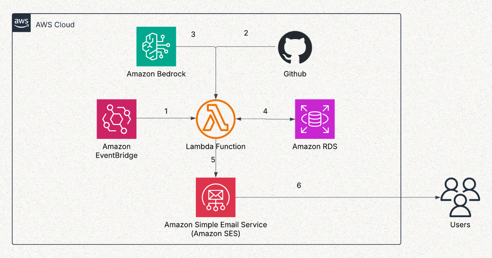

```
EventBridge Scheduler (daily, Asia/Kolkata)
        |
        v
     Lambda (Node.js 22)
        |
        v
    GitHub API  -->  Health Engine
                        |
                        v
              MySQL (RDS) + Bedrock (Nova Lite)
                        |
                        v
                   SES email report
```

| Component | Choice | Notes |
|---|---|---|
| Compute | AWS Lambda, Node.js 22, arm64 | Plain ES modules, no framework |
| Trigger | EventBridge Scheduler | Cron in the `Asia/Kolkata` timezone |
| AI analysis | Amazon Bedrock, Nova Lite | Converse API, one call per run |
| Storage | Amazon RDS, MySQL | Score history and run log |
| Email | Amazon SES | HTML + plain-text report |

## Scheduling and observability

The EventBridge schedule with its execution timezone and upcoming trigger dates (the hour shown here is from a test window; the production schedule is defined in the Terraform):

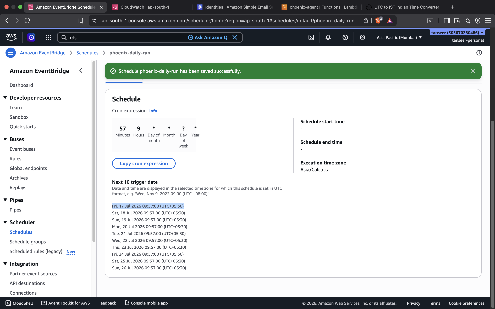

Each trigger produces a CloudWatch log stream — the run below scanned 13 repositories, analyzed 10, and logged one score line per repo:

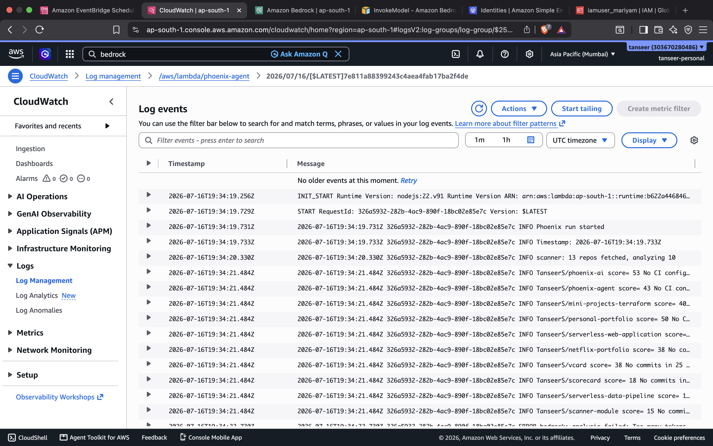

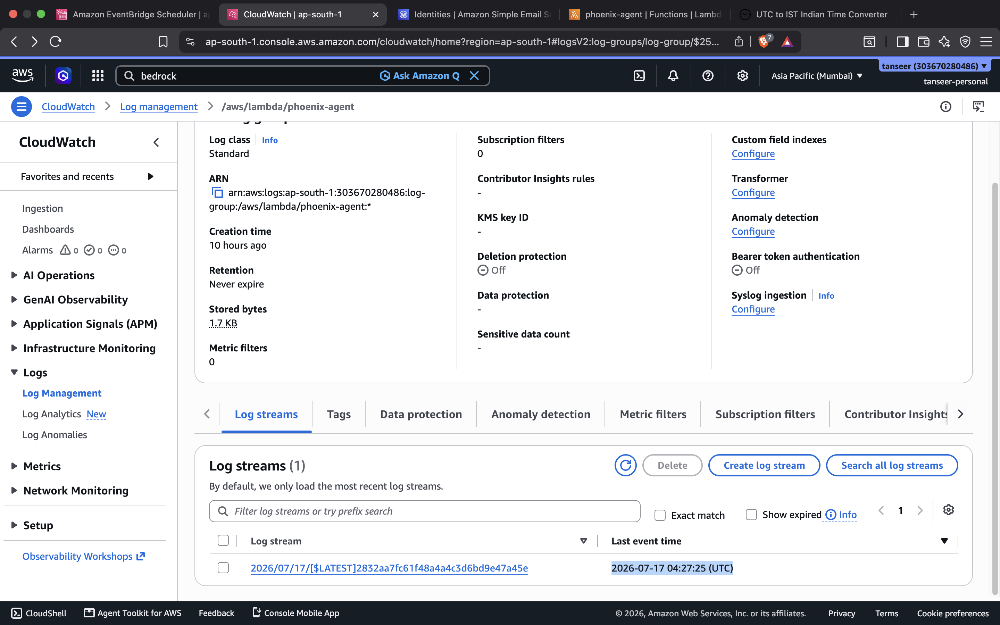

The deployed function and the verified SES identities:

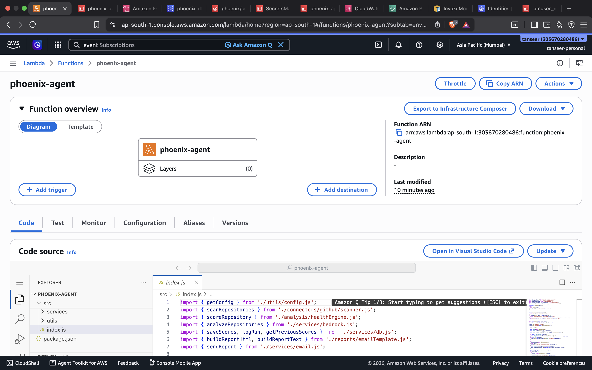

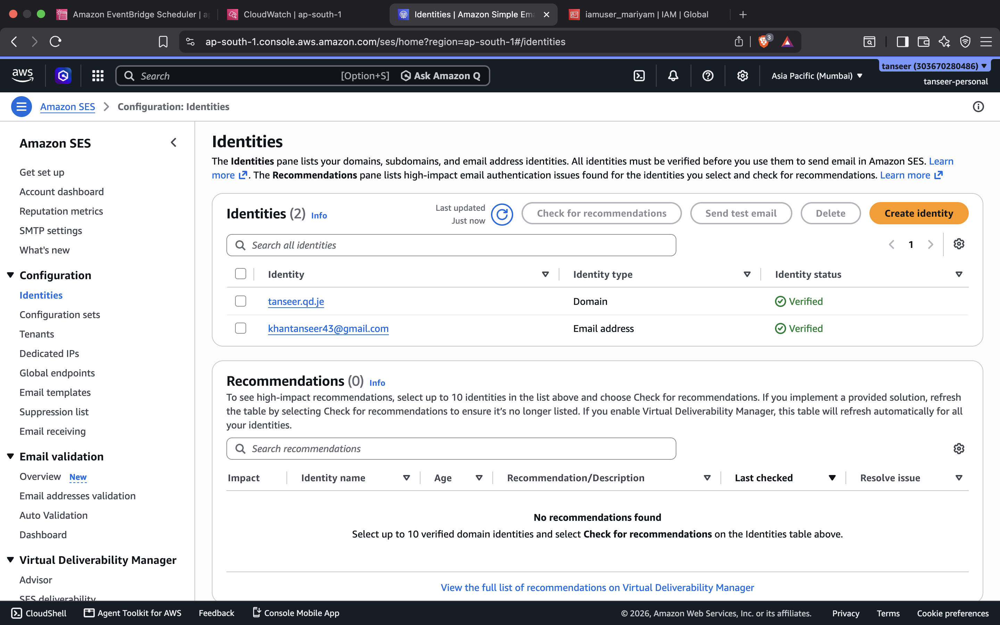

## Configuration

All configuration is passed to the Lambda as environment variables:

| Variable | Required | Purpose |
|---|---|---|
| `GITHUB_TOKEN` | yes | GitHub personal access token used to scan repositories |
| `DB_HOST`, `DB_USER`, `DB_PASSWORD`, `DB_NAME` | yes | MySQL connection settings |
| `SES_SENDER` | yes | Verified SES identity used as the sender |
| `REPORT_RECIPIENT` | yes | Address that receives the report |
| `BEDROCK_MODEL_ID` | yes | Bedrock model, e.g. `apac.amazon.nova-lite-v1:0` |
| `BEDROCK_REGION` | no | Overrides the Bedrock region; defaults to the Lambda's region |
| `BEDROCK_API_KEY` | no | Bedrock API key for cross-account bearer auth; IAM role auth is used when unset |

## Project structure

```
phoenix-agent/
  server/
    src/
      index.js                  Lambda handler: orchestrates the pipeline
      connectors/github/        GitHub REST client (native fetch) and scanner
      analysis/healthEngine.js  Pure scoring function, no I/O
      services/                 Bedrock, MySQL, and SES clients
      reports/emailTemplate.js  HTML and plain-text report rendering
      utils/config.js           Environment-based configuration
  infra/                        Terraform mirroring the deployed architecture
  docs/
  assets/                       Screenshots used in this README
```

## Infrastructure

The `infra/` directory contains Terraform that documents the deployed architecture — the Lambda function and its IAM role, the EventBridge schedule, the RDS instance, and the wiring between them. The deployment was done through the AWS console; the Terraform mirrors it so the setup is reproducible from scratch. See [infra/README.md](infra/README.md) for manual prerequisites (SES identity verification, Bedrock model access) and caveats before applying.
